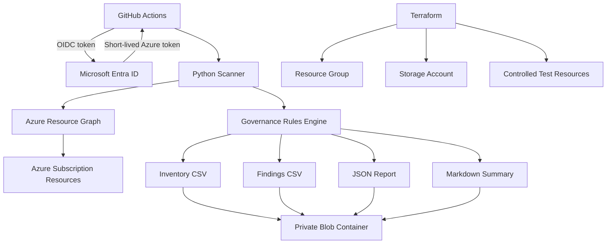

# Azure Cloud Inventory and Governance Tracker


An automated Azure inventory and governance solution that discovers subscription resources, identifies security and governance gaps, generates reports, and stores the results in private Azure Blob Storage.

## Table of Contents
- [Overview](#overview)
- [Architecture](#architecture)
- [Workflow](#workflow)
- [Governance Checks](#governance-checks)
- [Repository Structure](#repository-structure)
- [Authentication and Automation](#authentication-and-automation)
- [Deployment](#deployment)
- [Verification Results](#verification-results)
- [Screenshots](#screenshots)
- [Troubleshooting](#troubleshooting)
- [Technical Decisions](#technical-decisions)
- [Security, Limitations, and Improvements](#security-limitations-and-improvements)
- [Cleanup](#cleanup)
- [Skills Demonstrated](#skills-demonstrated)

---

## Overview
Cloud environments become difficult to govern as resources are created by different teams, projects, scripts, and pipelines.
Without a centralized inventory, teams may struggle to answer:
- What resources exist?
- Which regions and resource groups are in use?
- Which resources are missing ownership tags?
- Are public IP addresses still attached?
- Are SSH or RDP ports exposed to the Internet?
- Do storage accounts allow public access?
- Is there a repeatable record of findings?
This project creates a governance workflow that:
- Discovers resources across an Azure subscription
- Collects names, types, locations, tags, SKUs, and selected properties
- Detects missing governance tags
- Identifies public IP exposure
- Finds unassociated public IP addresses
- Reviews Network Security Group rules
- Detects Internet-exposed SSH and RDP
- Reviews Storage and Key Vault public access
- Generates CSV, JSON, and Markdown reports
- Uploads reports to private Blob Storage
- Preserves timestamped scan history
- Maintains stable `latest` report paths
- Runs manually or daily through GitHub Actions
- Authenticates without storing an Azure client secret
The final design demonstrates cloud engineering, cloud security, governance, automation, Infrastructure as Code, and troubleshooting skills.

---

## Architecture



| Component | Purpose |
|---|---|
| GitHub Actions | Runs scheduled and manual scans |
| Microsoft Entra ID | Validates the GitHub workload identity |
| OIDC federation | Enables secretless Azure authentication |
| Azure Resource Graph | Provides subscription-wide inventory data |
| Python scanner | Normalizes resources and evaluates governance rules |
| Terraform | Deploys infrastructure and validation resources |
| Azure Blob Storage | Stores current and historical reports |
| Azure RBAC | Limits workflow permissions |
| Pytest | Validates governance logic |

---

## Workflow
### 1. Trigger

```yaml
on:
  workflow_dispatch:
  schedule:
    - cron: "0 12 * * *"
```

### 2. Authenticate
GitHub requests an OIDC token representing the trusted repository and branch.
Microsoft Entra ID validates it and returns a short-lived Azure access token.
No Azure client secret is stored in GitHub.
### 3. Discover Resources
The scanner queries Azure Resource Graph for:
- Resource ID
- Name
- Type
- Resource group
- Subscription ID
- Region
- Tags
- SKU
- Kind
- Available properties
### 4. Evaluate Governance
Each normalized resource is evaluated against rule-based checks.
Every finding includes severity, evidence, recommendation, and resource metadata.
### 5. Generate Reports
Each scan creates:
- `inventory.csv`
- `findings.csv`
- `governance-report.json`
- `summary.md`
### 6. Store Results
Historical reports:

```text
scans/YYYY/MM/DD/TIMESTAMP/inventory.csv
scans/YYYY/MM/DD/TIMESTAMP/findings.csv
scans/YYYY/MM/DD/TIMESTAMP/governance-report.json
scans/YYYY/MM/DD/TIMESTAMP/summary.md
```

Latest reports:

```text
latest/inventory.csv
latest/findings.csv
latest/governance-report.json
latest/summary.md
```

---

## Azure Resources
Terraform deploys:
| Resource | Purpose |
|---|---|
| Resource Group | Contains project resources |
| Storage Account | Stores generated reports |
| Private Blob Container | Stores current and historical reports |
| Demo Public IP | Produces a known public exposure finding |
| Demo Network Security Group | Provides a controlled network test |
| Demo NSG Rule | Exposes SSH from the Internet for validation |
| Demo Storage Account | Produces known storage findings |
The demo resources are intentionally noncompliant and exist only to validate the scanner.

```hcl
enable_demo_findings = true
```

Set the variable to `false` to skip them.

---

## Governance Checks
| Check ID | Severity | Description |
|---|---|---|
| `TAG-001` | Medium | Required governance tags are missing |
| `NET-001` | Medium | A public IP address exists |
| `NET-002` | Medium | A public IP address is unassociated |
| `NET-003` | High | SSH or RDP is exposed to the Internet |
| `STG-001` | High | Anonymous Blob access is permitted |
| `STG-002` | Medium | Storage public-network access is enabled |
| `KV-001` | Medium | Key Vault public-network access is enabled |
### Required Tags

```text
environment
owner
project
managed_by
```

Example:

```hcl
tags = {
  project     = "azure-cloud-inventory-governance-tracker"
  environment = "lab"
  owner       = "kylon"
  managed_by  = "terraform"
}
```

### False-Positive Reduction
The first report included missing-tag findings for Azure-managed resources such as Network Watcher and Application Insights Smart Detection.
Those resources were excluded from tag checks, and a unit test was added.
The finding count dropped from 11 to 8 while preserving the meaningful findings.

---

## Repository Structure

```text
azure-cloud-inventory-governance-tracker/
├── .github/workflows/
│   ├── governance-scan.yml
│   └── validate.yml
├── docs/screenshots/
│   ├── 01-terraform-apply.png
│   ├── 02-python-resource-inventory.png
│   ├── 03-github-actions-governance-scan.png
│   ├── 04-blob-reports.png
│   └── 05-governance-report.png
├── infra/
│   ├── .terraform.lock.hcl
│   ├── main.tf
│   ├── outputs.tf
│   ├── providers.tf
│   ├── terraform.tfvars.example
│   └── variables.tf
├── queries/
│   ├── governance-findings.kql
│   └── resource-inventory.kql
├── scanner/
│   ├── __init__.py
│   ├── governance.py
│   ├── inventory.py
│   ├── reporting.py
│   ├── requirements.txt
│   └── run_scan.py
├── tests/test_governance.py
├── requirements-dev.txt
├── .gitignore
└── README.md
```

| File | Responsibility |
|---|---|
| `inventory.py` | Queries Resource Graph and normalizes resources |
| `governance.py` | Evaluates rules and creates findings |
| `reporting.py` | Creates CSV, JSON, and Markdown reports |
| `run_scan.py` | Runs the scanner and uploads reports |
| `test_governance.py` | Validates rules and exclusions |

---

## Authentication and Automation
### GitHub Permissions

```yaml
permissions:
  id-token: write
  contents: read
```

### Azure Role Assignments
| Role | Scope | Purpose |
|---|---|---|
| Reader | Subscription | Read resource metadata |
| Storage Blob Data Contributor | Report Storage Account | Upload reports |
The workflow does not receive `Contributor` or `Owner`.
### Governance Scan Workflow
`.github/workflows/governance-scan.yml`
Steps:
1. Check out the repository
2. Configure Python 3.12
3. Install dependencies
4. Run Pytest
5. Authenticate with OIDC
6. Run the scanner
7. Upload reports to Blob Storage
8. Store the JSON result as an artifact
### Validation Workflow
`.github/workflows/validate.yml`
Checks:
- Terraform formatting
- Terraform initialization without a backend
- Terraform validation
- Python dependency installation
- Python compilation
- Pytest execution

---

## Deployment
### Prerequisites
- Azure CLI
- Terraform
- Python 3.12
- Git
- GitHub CLI
### Clone and Authenticate

```bash
git clone https://github.com/kylon-cloud-dev/azure-cloud-inventory-governance-tracker.git
cd azure-cloud-inventory-governance-tracker
az login
az account set --subscription "<subscription-id>"
export ARM_SUBSCRIPTION_ID=$(az account show --query id --output tsv)
```

### Configure Variables

```bash
cp infra/terraform.tfvars.example infra/terraform.tfvars
```

Example:

```hcl
location             = "eastus"
name_prefix          = "cigtkylon"
environment          = "lab"
enable_demo_findings = true
```

Do not commit `terraform.tfvars`.
### Deploy

```bash
terraform -chdir=infra init
terraform -chdir=infra fmt -recursive
terraform -chdir=infra validate
terraform -chdir=infra plan -out=main.tfplan
terraform -chdir=infra apply main.tfplan
```

### Local Testing

```bash
python3.12 -m venv .venv
source .venv/bin/activate
pip install -r scanner/requirements.txt
pip install -r requirements-dev.txt
export TARGET_SUBSCRIPTION_ID=$(az account show --query id --output tsv)
export REPORT_STORAGE_ACCOUNT_URL="https://<storage-account>.blob.core.windows.net"
export REPORT_CONTAINER_NAME="inventory-reports"
```

Compile and test:

```bash
python -m py_compile \
  scanner/inventory.py \
  scanner/governance.py \
  scanner/reporting.py \
  scanner/run_scan.py
python -m pytest -v
```

Expected:

```text
3 passed
```

Run locally:

```bash
cd scanner
python run_scan.py
```

---

## Verification Results
The project successfully:
- Authenticated through GitHub OIDC
- Queried Azure Resource Graph
- Discovered subscription resources
- Normalized Azure metadata
- Evaluated governance rules
- Detected controlled findings
- Reduced false positives
- Passed three unit tests
- Generated four report formats
- Uploaded timestamped reports
- Updated `latest` report paths
- Uploaded a workflow artifact
- Completed without an Azure client secret
Validation run:

```text
Resources inventoried: 11
Governance findings: 8
High severity: 2
Medium severity: 6
Low severity: 0
```

Example findings:
- SSH exposed from the Internet
- Anonymous Blob access permitted
- Storage public-network access enabled
- Public IP address exists
- Public IP address is unassociated
- Required tags are missing

---

## Screenshots
### Terraform Deployment


### Python Inventory


### GitHub Actions Scan


### Blob Reports


### Governance Report


The workflow and report screenshots were captured during the full validation run before unused experimental Azure Function resources were removed.
They remain valid evidence of the scanner, OIDC authentication, report generation, and Blob uploads.

---

## Troubleshooting
### Noisy Tag Findings
The first scan included Azure-managed resources in the tag report.
Explicit exclusions and a unit test reduced the report from 11 findings to 8 actionable findings.
### Python Import and Syntax Errors
Pytest initially failed because the application folder was not a Python package.
Adding `__init__.py` fixed the import issue.
A duplicated block later caused:

```text
SyntaxError: 'return' outside function
```

The duplicate was removed, and all tests passed.
### Azure Functions Architecture Pivot
The original design used Azure Functions.
Deployment succeeded, but Azure repeatedly registered zero functions and returned `404`.
The following were verified:
- Functions were discovered locally
- Python 3.12 was configured
- Worker indexing was enabled
- The deployment ZIP was valid
- Required files were at the ZIP root
- Dependencies were included
- Trigger synchronization succeeded
- A minimal health endpoint also returned `404`
The final design moved execution to GitHub Actions.
This preserved scheduled execution, secure authentication, Resource Graph discovery, reporting, and Blob Storage while removing unnecessary compute.
### Terraform Hosting Issues
Testing Azure Functions also exposed:
- Flex Consumption runtime-setting differences
- Unsupported in-place plan conversion
- A Dynamic SKU quota of zero in East US
- Stale saved plans after state changes
Temporary Function resources were removed from the final architecture.
### Blob Authorization
Azure control-plane and Blob data-plane permissions are separate.
A Storage Account key was used temporarily for troubleshooting.
The production workflow uses identity and RBAC.
### GitHub OIDC Subject Mismatch
Azure Login initially returned:

```text
AADSTS700213: No matching federated identity record found
```

The federated credential subject was updated to match the actual GitHub token subject.
The next workflow succeeded.
### Git Ignore Rules
Terraform state, saved plans, Python packages, and local reports initially appeared as untracked files.
`.gitignore` was expanded to exclude generated and sensitive content while retaining `.terraform.lock.hcl`.

---

## Technical Decisions
### Azure Resource Graph
Resource Graph provides subscription-wide discovery through one query interface and is more scalable than separate API clients for every service.
### Python
Python provides strong Azure SDK support, JSON processing, report generation, modular design, and unit testing.
### Terraform
Terraform provides repeatable deployments, source-controlled infrastructure, validation, and controlled teardown.
### GitHub Actions
The scanner only needs periodic execution.
GitHub Actions provides schedules, manual runs, logs, artifacts, tests, and OIDC without permanent compute.
### OIDC
Workload identity federation removes client-secret storage, expiration, and rotation.
### Private Blob Storage
Blob Storage provides durable, low-cost storage for historical and current reports.
### Controlled Findings
Known noncompliant resources prove that the scanner detects real conditions.
### Report Formats
| Audience | Report |
|---|---|
| Cloud engineer | Inventory CSV |
| Governance analyst | Findings CSV |
| Automation system | JSON report |
| Manager or reviewer | Markdown summary |

---

## Security, Limitations, and Improvements
### Security
- Reader access is limited to the subscription
- Blob write access is limited to the report Storage Account
- No Azure client secret is stored in GitHub
- The report container is private
- HTTPS and TLS 1.2 are required
- Demo findings use isolated lab resources
- Terraform state and local settings are excluded from Git
### Limitations
- Resource Graph does not expose every service property
- Data-plane permissions are not fully evaluated
- Operating-system and container vulnerabilities are not scanned
- One subscription is scanned at a time
- Exceptions are defined in code
- No ticketing or historical dashboard is included
### Future Improvements
- Multi-subscription and management-group scanning
- Azure Policy and Defender for Cloud integration
- Configuration-driven rules and suppressions
- Historical trend analysis
- Email, Teams, or ServiceNow notifications
- HTML or Power BI dashboards
- Storage lifecycle policies
- GitHub issues for High findings
- Resource-lock and diagnostic-setting checks
- Key Vault expiration checks
- Public database endpoint checks
- Orphaned-resource and cost reporting

---

## Cleanup
Destroy Terraform resources:

```bash
terraform -chdir=infra plan -destroy
terraform -chdir=infra destroy
```

Remove the Entra application:

```bash
APP_ID=$(az ad app list \
  --display-name "gh-azure-inventory-governance-tracker" \
  --query "[0].appId" \
  --output tsv)
az ad app delete --id "$APP_ID"
```

Remove GitHub secrets and variables:

```bash
GH_REPO="kylon-cloud-dev/azure-cloud-inventory-governance-tracker"
gh secret delete AZURE_CLIENT_ID --repo "$GH_REPO"
gh secret delete AZURE_TENANT_ID --repo "$GH_REPO"
gh secret delete AZURE_SUBSCRIPTION_ID --repo "$GH_REPO"
gh variable delete REPORT_STORAGE_ACCOUNT_URL --repo "$GH_REPO"
gh variable delete REPORT_CONTAINER_NAME --repo "$GH_REPO"
```

The repository, screenshots, documentation, and workflow history remain available after teardown.

---

## Skills Demonstrated
### Azure
- Azure Resource Graph
- Azure Blob Storage
- Microsoft Entra ID
- Azure RBAC
- Azure CLI
- Network Security Groups
- Public IP addresses
- Storage security
### Terraform
- Resources
- Variables and outputs
- Dependencies
- Saved plans
- State management
- Provider lock files
- Cleanup
### Python
- Azure SDK integration
- Modular design
- Resource normalization
- Rule development
- Severity classification
- CSV, JSON, and Markdown reporting
- Pagination
- Logging
- Error handling
- Pytest
### DevOps and Security
- GitHub Actions
- Scheduled workflows
- Workflow artifacts
- OIDC authentication
- Repository secrets and variables
- Continuous validation
- Least-privilege RBAC
- Public exposure detection
- False-positive reduction
- Architecture redesign

---

## Outcome
The completed solution provides an automated and repeatable process for discovering Azure resources, identifying governance gaps, generating reports, and preserving scan history.
It demonstrates the full cloud engineering lifecycle:
1. Architecture design
2. Infrastructure deployment
3. Python development
4. Security rule creation
5. Unit testing
6. Secure identity configuration
7. Workflow automation
8. Troubleshooting
9. Architecture reassessment
10. Report verification
11. Documentation
12. Infrastructure cleanup
The final architecture combines Terraform-managed Azure infrastructure, GitHub Actions, Microsoft Entra workload identity federation, Azure Resource Graph, private Blob Storage, and Python governance logic into a practical cloud inventory solution.