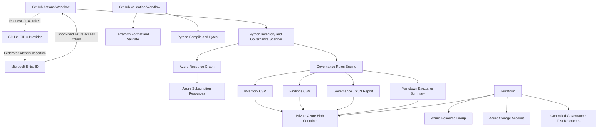
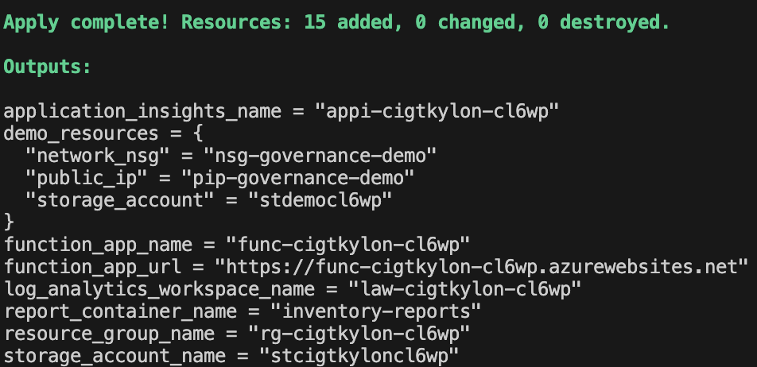
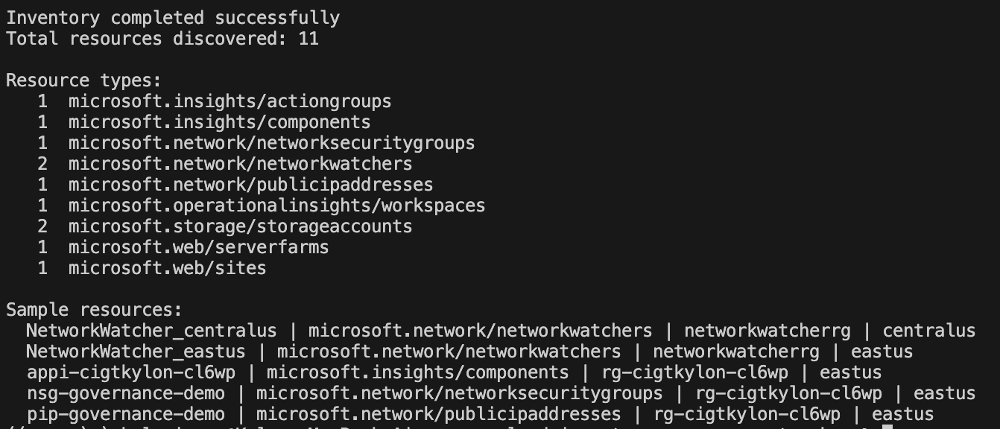
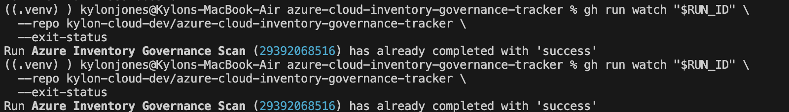
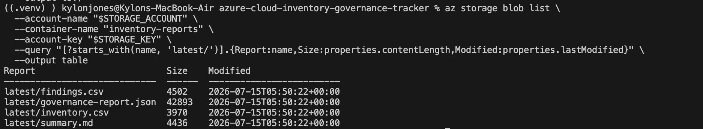
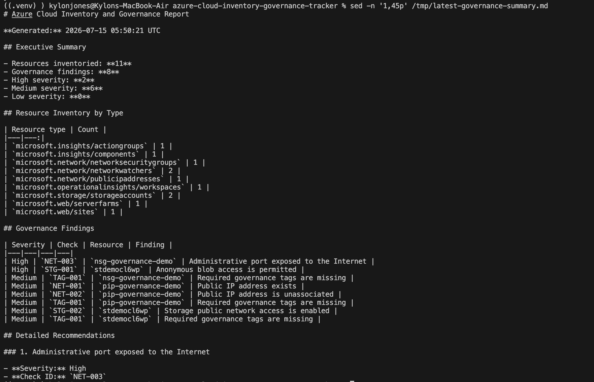

# Azure Cloud Inventory and Governance Tracker


An automated Azure inventory and governance solution that discovers resources across an Azure subscription, evaluates them for security and governance gaps, generates structured reports, and stores the results in private Azure Blob Storage.

The project uses Python, Azure Resource Graph, Terraform, GitHub Actions, Microsoft Entra workload identity federation, Azure RBAC, and Blob Storage.

---

## Table of Contents

- [Project Overview](#project-overview)
- [Business Problem](#business-problem)
- [Solution](#solution)
- [Architecture](#architecture)
- [How the Workflow Operates](#how-the-workflow-operates)
- [Azure Resources](#azure-resources)
- [Tools and Technologies](#tools-and-technologies)
- [Governance Checks](#governance-checks)
- [Repository Structure](#repository-structure)
- [Python Components](#python-components)
- [Secure Authentication with GitHub OIDC](#secure-authentication-with-github-oidc)
- [Automation Workflows](#automation-workflows)
- [Deployment Guide](#deployment-guide)
- [Local Testing](#local-testing)
- [Verification Results](#verification-results)
- [Project Screenshots](#project-screenshots)
- [Troubleshooting](#troubleshooting)
- [Technical Decisions](#technical-decisions)
- [Security Considerations](#security-considerations)
- [Project Limitations](#project-limitations)
- [Future Improvements](#future-improvements)
- [Cleanup](#cleanup)
- [Skills Demonstrated](#skills-demonstrated)

---

## Project Overview

Cloud environments become difficult to manage when teams do not have a centralized view of deployed resources, ownership, public exposure, tagging consistency, or security configuration.

This project creates an automated Azure governance workflow that:

- Discovers resources across an Azure subscription
- Collects important resource metadata
- Detects missing governance tags
- Identifies public IP addresses
- Detects unassociated public IP addresses
- Reviews Network Security Group rules
- Detects SSH and RDP exposure from the Internet
- Reviews Azure Storage public-access settings
- Reviews Key Vault public-network access
- Generates CSV, JSON, and Markdown reports
- Uploads timestamped reports to private Blob Storage
- Maintains a `latest` version of every report
- Runs manually or automatically through GitHub Actions
- Authenticates to Azure without storing a client secret

The final design is intended to demonstrate realistic junior cloud engineering, cloud security, governance, automation, and DevOps skills.

---

## Business Problem

Azure subscriptions can accumulate resources created by different teams, projects, scripts, and deployment pipelines.

Without automated inventory and governance controls, organizations may struggle to answer basic operational questions:

- What resources currently exist?
- Which regions are being used?
- Who owns each resource?
- Which resources are missing required tags?
- Are any administrative ports exposed to the Internet?
- Are there public IP addresses that are no longer attached?
- Do storage accounts allow anonymous Blob access?
- Are public endpoints enabled where private connectivity would be more appropriate?
- Is there a historical record of governance findings?

Manual reviews are slow, inconsistent, and difficult to repeat.

A cloud inventory and governance scanner provides a repeatable way to collect resource metadata and identify configuration gaps before they become larger security or operational problems.

---

## Solution

The final solution uses GitHub Actions as the scheduled execution platform.

During each run, the workflow:

1. Authenticates to Azure through Microsoft Entra workload identity federation.
2. Receives a short-lived Azure access token.
3. Runs Python unit tests.
4. Executes the Python inventory scanner.
5. Queries Azure Resource Graph.
6. Normalizes the returned resource metadata.
7. Evaluates every resource against governance rules.
8. Generates four report formats.
9. Uploads reports to private Azure Blob Storage.
10. Uploads a workflow result artifact to GitHub Actions.

No Azure client secret is stored in GitHub.

---

## Architecture



---

## Final Architecture Summary

| Component | Purpose |
|---|---|
| GitHub Actions | Runs scheduled and manual governance scans |
| Microsoft Entra ID | Validates GitHub OIDC tokens |
| Workload identity federation | Enables secretless Azure authentication |
| Azure Resource Graph | Discovers subscription-wide resource metadata |
| Python scanner | Normalizes inventory and evaluates governance rules |
| Terraform | Deploys Azure infrastructure and test resources |
| Azure Blob Storage | Stores timestamped and current reports |
| Azure RBAC | Limits workflow permissions |
| Pytest | Validates governance logic |
| GitHub Actions artifacts | Stores execution-level scan results |

---

## How the Workflow Operates

### 1. Workflow trigger

The governance scan starts in one of two ways:

- Manual execution through `workflow_dispatch`
- Automatic daily execution through a cron schedule

```yaml
on:
  workflow_dispatch:
  schedule:
    - cron: "0 12 * * *"
```

### 2. Secure Azure authentication

The workflow requests an OpenID Connect token from GitHub.

Microsoft Entra ID verifies:

- Token issuer
- Token audience
- GitHub organization
- GitHub repository
- Repository identifier
- Branch reference
- Federated credential subject

When the token is accepted, the workflow receives temporary Azure access instead of using a stored password or client secret.

### 3. Resource discovery

The scanner submits a KQL-based query through Azure Resource Graph.

The query collects:

- Resource ID
- Resource name
- Resource type
- Resource group
- Subscription ID
- Azure region
- Tags
- SKU information
- Resource kind
- Available resource properties

### 4. Data normalization

Azure services do not always return metadata in identical formats.

The Python scanner normalizes each Resource Graph result into a consistent structure before governance checks are performed.

### 5. Governance evaluation

Every resource is passed through the governance rules engine.

Findings include:

- Severity
- Check ID
- Category
- Finding title
- Description
- Evidence
- Recommendation
- Resource name
- Resource type
- Resource group
- Region
- Resource ID

### 6. Report generation

Each scan creates:

- Full resource inventory CSV
- Governance findings CSV
- Complete JSON report
- Human-readable Markdown summary

### 7. Blob upload

The scanner uploads both timestamped and current reports.

Timestamped reports preserve historical results:

```text
scans/YYYY/MM/DD/TIMESTAMP/inventory.csv
scans/YYYY/MM/DD/TIMESTAMP/findings.csv
scans/YYYY/MM/DD/TIMESTAMP/governance-report.json
scans/YYYY/MM/DD/TIMESTAMP/summary.md
```

Current reports provide a stable path for the newest scan:

```text
latest/inventory.csv
latest/findings.csv
latest/governance-report.json
latest/summary.md
```

---

## Azure Resources

Terraform deploys the final Azure infrastructure.

| Azure resource | Purpose |
|---|---|
| Resource Group | Contains project infrastructure and validation resources |
| Storage Account | Stores generated inventory and governance reports |
| Private Blob Container | Holds timestamped and current reports |
| Demo Public IP | Creates a known public-IP finding |
| Demo Network Security Group | Creates a controlled network-governance test |
| Demo NSG Rule | Allows inbound SSH from the Internet for scanner validation |
| Demo Storage Account | Creates known storage-governance findings |

The demo resources are intentionally noncompliant.

They allow the scanner to be tested against known conditions instead of simply completing without detecting anything.

The resources are controlled using:

```hcl
enable_demo_findings = true
```

Setting the variable to `false` prevents the test resources from being deployed.

---

## Tools and Technologies

### Microsoft Azure

- Azure Resource Graph
- Azure Blob Storage
- Microsoft Entra ID
- Azure RBAC
- Azure CLI
- Azure Storage data-plane authorization
- Public IP addresses
- Network Security Groups
- Azure Storage security settings

### Infrastructure and automation

- Terraform
- GitHub Actions
- GitHub OIDC
- Workload identity federation
- GitHub CLI
- Scheduled workflows
- Workflow artifacts

### Development

- Python 3.12
- Azure Python SDK
- Pytest
- CSV
- JSON
- Markdown
- Kusto Query Language
- Virtual environments
- Git
- GitHub

---

## Governance Checks

| Check ID | Severity | Category | Governance check |
|---|---|---|---|
| `TAG-001` | Medium | Tagging | Required governance tags are missing |
| `NET-001` | Medium | Network Exposure | A public IP address exists |
| `NET-002` | Medium | Resource Hygiene | A public IP address is unassociated |
| `NET-003` | High | Network Exposure | An administrative port is exposed to the Internet |
| `STG-001` | High | Data Exposure | Anonymous Blob access is permitted |
| `STG-002` | Medium | Network Exposure | Storage public-network access is enabled |
| `KV-001` | Medium | Network Exposure | Key Vault public-network access is enabled |

---

## Required Governance Tags

The scanner checks resources for these required tags:

```text
environment
owner
project
managed_by
```

These tags support:

- Resource ownership
- Environment classification
- Cost allocation
- Incident response
- Lifecycle management
- Automation
- Governance reporting

Example compliant tags:

```hcl
tags = {
  project     = "azure-cloud-inventory-governance-tracker"
  environment = "lab"
  owner       = "kylon"
  managed_by  = "terraform"
}
```

---

## False-Positive Reduction

A useful governance scanner should produce actionable findings instead of unnecessary noise.

During testing, the scanner initially flagged Azure-managed resources such as:

- Network Watcher
- Application Insights Smart Detection

These resources did not provide useful ownership findings for the lab.

The scanner was updated to exclude selected Azure-managed resources from required-tag checks.

A Pytest unit test verifies that those exclusions remain in place.

This reduced the original finding count from 11 to 8 while preserving the meaningful governance and security findings.

---

## Repository Structure

```text
azure-cloud-inventory-governance-tracker/
├── .github/
│   └── workflows/
│       ├── governance-scan.yml
│       └── validate.yml
├── docs/
│   └── screenshots/
│       ├── 01-terraform-apply.png
│       ├── 02-python-resource-inventory.png
│       ├── 03-github-actions-governance-scan.png
│       ├── 04-blob-reports.png
│       └── 05-governance-report.png
├── infra/
│   ├── main.tf
│   ├── outputs.tf
│   ├── providers.tf
│   ├── variables.tf
│   ├── terraform.tfvars.example
│   └── .terraform.lock.hcl
├── queries/
│   ├── governance-findings.kql
│   └── resource-inventory.kql
├── scanner/
│   ├── __init__.py
│   ├── governance.py
│   ├── inventory.py
│   ├── reporting.py
│   ├── requirements.txt
│   └── run_scan.py
├── tests/
│   └── test_governance.py
├── requirements-dev.txt
├── .gitignore
└── README.md
```

---

## Python Components

### `scanner/inventory.py`

The inventory module:

- Authenticates to Azure
- Queries Azure Resource Graph
- Collects subscription-wide resource data
- Supports pagination
- Handles subscriptions with more than 1,000 resources
- Normalizes Azure metadata
- Produces resource-type summaries

The same inventory logic can run locally or through GitHub Actions.

### `scanner/governance.py`

The governance module:

- Evaluates every discovered resource
- Detects missing tags
- Detects public IP addresses
- Detects unassociated public IPs
- Reviews Network Security Group rules
- Detects Internet-exposed SSH and RDP
- Reviews Storage Account public access
- Reviews Key Vault network exposure
- Assigns severity levels
- Generates remediation recommendations
- Sorts findings by severity
- Excludes selected Azure-managed resources

### `scanner/reporting.py`

The reporting module generates:

- `inventory.csv`
- `findings.csv`
- `governance-report.json`
- `summary.md`

The reports serve different audiences:

| Report | Intended use |
|---|---|
| Inventory CSV | Spreadsheet analysis and asset inventory |
| Findings CSV | Governance remediation tracking |
| JSON report | Automation and machine processing |
| Markdown summary | Human-readable review and documentation |

### `scanner/run_scan.py`

The runner is the GitHub Actions entry point.

It:

1. Validates required environment variables
2. Uses the Azure CLI authentication session created by `azure/login`
3. Queries Azure Resource Graph
4. Runs governance checks
5. Generates reports
6. Uploads reports to Blob Storage
7. Prints a structured JSON execution result
8. Returns a nonzero exit code if the scan fails

---

## Secure Authentication with GitHub OIDC

The workflow uses Microsoft Entra workload identity federation.

No Azure password or client secret is stored in the repository.

### Authentication flow

```text
GitHub Actions
      |
      | Requests OIDC token
      v
GitHub OIDC Provider
      |
      | Signed token containing repository identity
      v
Microsoft Entra ID
      |
      | Validates federated credential
      v
Short-lived Azure access token
```

### GitHub workflow permissions

```yaml
permissions:
  id-token: write
  contents: read
```

`id-token: write` allows the workflow to request a GitHub OIDC token.

`contents: read` allows the workflow to check out the repository.

### Azure role assignments

The GitHub service principal receives:

| Role | Scope | Purpose |
|---|---|---|
| Reader | Azure subscription | Discover resource metadata |
| Storage Blob Data Contributor | Project Storage Account | Upload governance reports |

The workflow does not receive the broad Azure `Contributor` role.

This follows least-privilege principles by separating:

- Control-plane inventory access
- Blob data-plane write access

---

## Automation Workflows

### Governance scan workflow

File:

```text
.github/workflows/governance-scan.yml
```

The workflow:

1. Checks out the repository
2. Configures Python 3.12
3. Installs dependencies
4. Runs Pytest
5. Authenticates to Azure with OIDC
6. Runs the inventory scanner
7. Uploads reports to Blob Storage
8. Saves the workflow scan result as a GitHub artifact

The workflow can run manually or daily.

### Validation workflow

File:

```text
.github/workflows/validate.yml
```

The validation workflow runs on pushes and pull requests.

It performs:

#### Terraform validation

- Terraform formatting check
- Terraform initialization without a backend
- Terraform configuration validation

#### Python validation

- Python 3.12 setup
- Dependency installation
- Python compilation
- Pytest unit testing

This provides continuous validation of both infrastructure and application code.

---

## Deployment Guide

### Prerequisites

Install:

- Azure CLI
- Terraform
- Python 3.12
- Git
- GitHub CLI

Confirm the tools:

```bash
az version
terraform version
python3.12 --version
git --version
gh --version
```

### Clone the repository

```bash
git clone https://github.com/kylon-cloud-dev/azure-cloud-inventory-governance-tracker.git

cd azure-cloud-inventory-governance-tracker
```

### Authenticate to Azure

```bash
az login
```

Select the correct subscription:

```bash
az account list \
  --query "[].{Name:name,SubscriptionId:id,State:state}" \
  --output table
```

```bash
az account set --subscription "<subscription-id>"
```

Configure Terraform authentication:

```bash
export ARM_SUBSCRIPTION_ID=$(az account show --query id --output tsv)
```

### Review Terraform variables

Copy the example file:

```bash
cp infra/terraform.tfvars.example infra/terraform.tfvars
```

Example:

```hcl
location             = "eastus"
name_prefix          = "cigtkylon"
environment          = "lab"
enable_demo_findings = true
```

Do not commit `terraform.tfvars`.

### Initialize Terraform

```bash
terraform -chdir=infra init
```

### Format the configuration

```bash
terraform -chdir=infra fmt -recursive
```

### Validate the configuration

```bash
terraform -chdir=infra validate
```

### Create a deployment plan

```bash
terraform -chdir=infra plan -out=main.tfplan
```

### Deploy

```bash
terraform -chdir=infra apply main.tfplan
```

### View outputs

```bash
terraform -chdir=infra output
```

---

## Local Testing

### Create a Python virtual environment

```bash
python3.12 -m venv .venv
```

Activate it:

```bash
source .venv/bin/activate
```

### Install dependencies

```bash
pip install -r scanner/requirements.txt
pip install -r requirements-dev.txt
```

### Configure environment variables

```bash
export TARGET_SUBSCRIPTION_ID=$(az account show --query id --output tsv)

export REPORT_STORAGE_ACCOUNT_URL="https://<storage-account-name>.blob.core.windows.net"

export REPORT_CONTAINER_NAME="inventory-reports"
```

### Run syntax checks

```bash
python -m py_compile \
  scanner/inventory.py \
  scanner/governance.py \
  scanner/reporting.py \
  scanner/run_scan.py
```

### Run unit tests

```bash
python -m pytest -v
```

Expected result:

```text
3 passed
```

### Run the scanner locally

```bash
cd scanner
python run_scan.py
```

Return to the repository root:

```bash
cd ..
```

---

## Resource Graph Query

The inventory scanner uses a query similar to:

```kusto
Resources
| project
    id,
    name,
    type,
    resourceGroup,
    subscriptionId,
    location,
    tags,
    sku,
    kind,
    properties
| order by id asc
```

The documented query is stored in:

```text
queries/resource-inventory.kql
```

Azure Resource Graph was selected because it can discover many Azure resource types through one query interface instead of requiring a different API call for every service.

---

## Verification Results

The completed project successfully:

- Authenticated to Azure through GitHub OIDC
- Queried Azure Resource Graph
- Discovered subscription resources
- Normalized resource metadata
- Evaluated governance rules
- Detected controlled security findings
- Removed noisy Azure-managed findings
- Passed three Pytest tests
- Generated four report formats
- Uploaded timestamped reports
- Updated the `latest` report paths
- Uploaded a GitHub Actions execution artifact
- Completed without storing an Azure client secret

### Validation scan results

During the full validation run, the scanner identified:

- 11 Azure resources
- 8 governance findings
- 2 High-severity findings
- 6 Medium-severity findings
- 0 Low-severity findings

The exact resource and finding counts may change as resources are added or removed from the subscription.

### Example findings

- Inbound SSH exposed from the Internet
- Anonymous Blob access permitted
- Storage public-network access enabled
- Public IP address exists
- Public IP address is unassociated
- Required ownership and lifecycle tags are missing

---

## Project Screenshots

The screenshots are stored under:

```text
docs/screenshots/
```

The filenames must match the paths used below.

### 1. Terraform Infrastructure Deployment

This screenshot confirms that Terraform successfully deployed the Azure infrastructure.



---

### 2. Python Resource Inventory

This screenshot shows the Python scanner querying Azure Resource Graph and summarizing discovered resource types.



---

### 3. Successful GitHub Actions Governance Scan

This screenshot shows the automated workflow completing successfully, including unit testing, OIDC authentication, the Azure inventory scan, and artifact upload.



---

### 4. Reports Stored in Azure Blob Storage

This screenshot confirms that the scanner uploaded the latest inventory and governance reports to the private Blob container.



---

### 5. Governance Report Results

This screenshot shows the human-readable governance summary, including detected findings and severity totals.



---

### Screenshot note

The workflow and report screenshots were captured during the full validation run before unused experimental Azure Function resources were removed.

The screenshots remain valid evidence of:

- Successful automation
- Azure authentication
- Resource inventory
- Governance evaluation
- Report generation
- Blob Storage upload

The final production architecture uses GitHub Actions rather than Azure Functions.

---

## Troubleshooting

### Terraform state and sensitive files appeared in Git status

**Problem**

Thousands of files appeared as untracked, including:

- `.venv`
- Terraform state
- Terraform plans
- Python packages
- Local Azure Function settings
- Generated reports

**Cause**

The original `.gitignore` did not fully cover the project’s generated files.

**Resolution**

The `.gitignore` was replaced with rules covering:

```text
.venv/
.python_packages/
__pycache__/
*.tfstate
*.tfstate.*
*.tfplan
terraform.tfvars
local.settings.json
reports/
scan-result.json
```

The Terraform provider lock file remains tracked for reproducible provider versions.

---

### Azure Resource Graph output displayed only wrapper metadata

**Problem**

The Azure CLI query displayed fields such as:

```text
Count
Total_records
```

instead of the actual resource rows.

**Cause**

The CLI was formatting the Resource Graph response wrapper rather than its nested `data` field.

**Resolution**

Added:

```bash
--query "data"
```

before formatting the response as a table.

---

### Governance reports contained noisy tag findings

**Problem**

The first report contained 11 findings, including missing-tag findings for:

- Network Watcher
- Application Insights Smart Detection

**Cause**

These are Azure-managed resources that did not provide meaningful ownership findings for this project.

**Resolution**

The governance engine was updated with explicit exclusions.

A unit test was added to make sure Azure-managed resources do not generate tag findings.

The report was reduced from:

```text
11 findings
```

to:

```text
8 actionable findings
```

---

### Python tests could not import the scanner package

**Problem**

Pytest returned:

```text
ModuleNotFoundError
```

**Cause**

The Python application folder did not initially contain `__init__.py`.

**Resolution**

Added:

```text
__init__.py
```

and ran tests using:

```bash
python -m pytest -v
```

This ensured Pytest used the active virtual environment.

---

### Python returned `return outside function`

**Problem**

Python compilation failed with:

```text
SyntaxError: 'return' outside function
```

**Cause**

A duplicated governance logic block was accidentally pasted outside the function body.

**Resolution**

Inspected the file with numbered lines:

```bash
nl -ba scanner/governance.py
```

Removed the duplicated block and reran:

```bash
python -m py_compile scanner/governance.py
python -m pytest -v
```

All three tests passed.

---

### Flex Consumption rejected `FUNCTIONS_WORKER_RUNTIME`

**Problem**

Terraform returned a `400 Bad Request` when attempting to add:

```hcl
FUNCTIONS_WORKER_RUNTIME = "python"
```

to a Flex Consumption Function App.

**Cause**

Flex Consumption defines its runtime through:

```hcl
runtime_name
runtime_version
```

It rejects the traditional `FUNCTIONS_WORKER_RUNTIME` application setting.

**Resolution**

Removed the invalid setting and retained:

```hcl
runtime_name    = "python"
runtime_version = "3.12"
```

---

### Azure Functions deployed but registered zero functions

**Problem**

Azure successfully accepted the deployment package, but the platform repeatedly reported:

```text
0 functions found
0 functions loaded
No HTTP routes mapped
```

The HTTP endpoint returned:

```text
404
```

**Investigation**

The following were verified:

- Both functions were discovered locally
- Python 3.12 was configured
- Worker indexing was enabled
- `host.json` existed at the package root
- `function_app.py` existed at the package root
- Python dependencies existed under `.python_packages`
- The deployment ZIP was valid
- The ZIP used the expected `PK` header
- Trigger synchronization returned successfully
- A minimal health endpoint also returned `404`
- No useful Python import exception appeared in telemetry

**Decision**

The scanner logic and deployment package were valid, but the Azure host failed to index even a minimal Python function.

Rather than continue spending time on an unreliable compute layer, the architecture was changed to GitHub Actions.

This preserved:

- Scheduled execution
- Manual execution
- Secure Azure authentication
- Resource inventory
- Governance analysis
- Automated reporting
- Blob Storage
- Testing
- Audit evidence

It also removed unnecessary compute infrastructure.

---

### Linux Consumption plan could not be created in East US

**Problem**

Azure rejected the Linux Consumption plan with a regional quota error.

**Cause**

The subscription had a Dynamic SKU quota of zero in East US.

**Resolution**

A temporary Linux Consumption validation plan was deployed in Central US.

The Function resources were later removed after the GitHub Actions architecture became final.

---

### Terraform could not convert Flex Consumption to Linux Consumption

**Problem**

Terraform attempted to update the App Service Plan from:

```text
FlexConsumption
```

to:

```text
Dynamic
```

Azure rejected the update.

**Cause**

Azure does not support converting those hosting plan families in place.

**Resolution**

Created a new plan with:

- A new Terraform resource address
- A new Azure resource name
- The `Y1` Linux Consumption SKU

This allowed Terraform to create the new plan rather than modify the Flex plan.

---

### Saved Terraform plan became stale

**Problem**

Terraform returned:

```text
Saved plan is stale
```

**Cause**

The Terraform state changed after the saved plan was created.

**Resolution**

Generated a new plan:

```bash
terraform -chdir=infra plan -out=updated.tfplan
```

and applied the new plan instead of reusing the outdated file.

---

### Blob inspection failed with Azure CLI identity authentication

**Problem**

The signed-in Azure user could not inspect a Blob container using:

```bash
--auth-mode login
```

**Cause**

The user identity did not have the required Storage Blob data-plane role.

Azure management permissions and Blob data permissions are separate.

**Resolution**

Used a Storage Account key temporarily for troubleshooting.

The key was stored only in a temporary shell variable and removed afterward:

```bash
unset STORAGE_KEY
```

The production GitHub workflow continues to use identity-based authorization.

---

### GitHub OIDC authentication failed

**Problem**

The Azure Login action returned:

```text
AADSTS700213: No matching federated identity record found
```

**Cause**

The original federated identity credential used a traditional repository subject.

GitHub issued a token containing immutable organization and repository identifiers.

The incoming token subject did not exactly match the subject stored in Microsoft Entra ID.

**Resolution**

Read the actual subject claim from the failed GitHub Actions log.

Updated the Microsoft Entra federated credential so its:

- Issuer
- Subject
- Audience
- Branch reference

matched the presented GitHub token.

After propagation, the workflow authenticated successfully without a client secret.

---

## Technical Decisions

### Azure Resource Graph instead of individual service APIs

Azure Resource Graph provides subscription-wide discovery through one query interface.

Without Resource Graph, the scanner would need separate service clients and API calls for:

- Virtual machines
- Storage accounts
- Network resources
- Key Vaults
- Monitoring resources
- Web applications
- Other Azure services

Resource Graph makes inventory collection more scalable and easier to maintain.

---

### Python for governance evaluation

Python provides:

- Strong Azure SDK support
- Flexible dictionary and JSON processing
- CSV generation
- Unit testing
- Simple modular application design
- Easy GitHub Actions integration

The project separates inventory, governance, reporting, and execution logic into individual modules.

---

### Terraform for infrastructure

Terraform provides:

- Repeatable Azure deployments
- Source-controlled infrastructure
- Predictable resource naming
- Reusable variables
- Automated formatting and validation
- Controlled teardown
- A clear record of cloud architecture decisions

---

### GitHub Actions instead of permanent compute

The scanner only needs to run periodically.

Maintaining a continuously available Function App or server is unnecessary for a daily inventory scan.

GitHub Actions provides:

- Scheduled execution
- Manual execution
- Execution logs
- Workflow artifacts
- Integrated testing
- OIDC support
- No permanent compute resource

---

### OIDC instead of stored credentials

Client secrets introduce:

- Secret storage
- Expiration management
- Rotation requirements
- Credential leakage risk

GitHub OIDC provides temporary tokens tied to the trusted repository and branch.

---

### Private Blob Storage for governance reports

Blob Storage provides:

- Durable report storage
- Low cost
- Timestamped history
- Stable `latest` paths
- CSV, JSON, and Markdown support
- Azure RBAC integration

The Blob container does not allow anonymous public access.

---

### Controlled noncompliant resources

A scanner that produces zero findings may be working, or it may be missing problems.

Known test resources provide measurable evidence that the governance rules work.

The controlled findings include:

- Public IP exposure
- Unassociated public IP
- Internet-exposed SSH
- Anonymous Blob access capability
- Public Storage endpoint
- Missing required tags

---

### False-positive tuning

The quality of a governance scanner is not measured only by the number of findings.

It must distinguish between:

- Actionable configuration gaps
- Accepted exceptions
- Azure-managed resources
- Expected platform behavior

Reducing false positives improves trust in the scanner.

---

### Multiple report formats

Different users need different outputs.

| Audience | Report |
|---|---|
| Cloud engineer | Inventory CSV |
| Security or governance analyst | Findings CSV |
| Automation system | JSON report |
| Manager or reviewer | Markdown summary |

---

## Security Considerations

### Least privilege

The GitHub identity receives only:

- Subscription Reader
- Storage Blob Data Contributor on the project Storage Account

It does not receive Azure Contributor or Owner.

### Secretless Azure login

GitHub Actions uses OIDC instead of storing an Azure service-principal secret.

### Private report container

The Blob container is configured as private.

### Secure transport

The Storage Account requires HTTPS and TLS 1.2.

### Public Blob access disabled on report storage

The main report Storage Account prevents nested items from being configured for anonymous public access.

### Controlled demo findings

The intentionally exposed resources are isolated lab resources.

No production workloads, virtual machines, credentials, or confidential data are attached to them.

### Sensitive files excluded from Git

The repository excludes:

- Terraform state
- Terraform plans
- Local variable files
- Python virtual environments
- Local settings
- Generated reports
- Deployment packages

---

## Project Limitations

This project evaluates control-plane metadata available through Azure Resource Graph.

It is not a complete vulnerability scanner or Cloud Security Posture Management platform.

Limitations include:

- Some resource properties may not appear in Resource Graph.
- Some properties may be scrubbed or summarized.
- Data-plane permissions are not fully evaluated.
- Operating-system vulnerabilities are not scanned.
- Container vulnerabilities are not scanned.
- Runtime network traffic is not analyzed.
- Resource-level exceptions are hard-coded instead of configuration-driven.
- The project scans one subscription at a time.
- Findings are rule-based rather than correlated with business context.
- No ticketing workflow is currently integrated.

---

## Future Improvements

Possible improvements include:

- Azure Policy integration
- Microsoft Defender for Cloud findings
- Management-group scanning
- Multi-subscription inventory
- Configuration-driven governance rules
- YAML-based suppressions
- Finding expiration dates
- Severity thresholds
- Finding comparison between scans
- Historical trend dashboards
- Email or Microsoft Teams notifications
- ServiceNow ticket creation
- HTML reporting
- Power BI reporting
- Storage lifecycle rules
- Report retention controls
- Policy-compliance percentages
- Owner-based report distribution
- GitHub issue creation for High findings
- Private Endpoint deployment
- Key Vault secret and certificate expiration checks
- Managed disk encryption checks
- Virtual machine managed-identity checks
- Public database endpoint checks
- Azure SQL firewall checks
- App Service HTTPS and TLS checks
- Resource-lock validation
- Diagnostic-setting validation
- Cost and orphaned-resource reporting

---

## Cleanup

### Destroy Terraform-managed resources

Preview the destruction:

```bash
terraform -chdir=infra plan -destroy
```

Destroy the resources:

```bash
terraform -chdir=infra destroy
```

Confirm by entering:

```text
yes
```

### Remove the Microsoft Entra application

The Entra application and federated credential were created with Azure CLI rather than Terraform.

Find the application:

```bash
APP_ID=$(az ad app list \
  --display-name "gh-azure-inventory-governance-tracker" \
  --query "[0].appId" \
  --output tsv)
```

Confirm it exists without printing unnecessary details:

```bash
[[ -n "$APP_ID" ]] && echo "Entra application found"
```

Delete it:

```bash
az ad app delete --id "$APP_ID"
```

### Remove GitHub configuration

After the final workflow run, the following repository secrets can be removed:

```text
AZURE_CLIENT_ID
AZURE_TENANT_ID
AZURE_SUBSCRIPTION_ID
```

Repository variables can also be removed:

```text
REPORT_STORAGE_ACCOUNT_URL
REPORT_CONTAINER_NAME
```

---

## Skills Demonstrated

This project demonstrates hands-on experience with:

### Azure

- Azure subscriptions
- Azure Resource Graph
- Azure Blob Storage
- Azure RBAC
- Microsoft Entra ID
- Workload identity federation
- Storage Account security
- Network Security Groups
- Public IP addresses
- Azure CLI
- Resource metadata analysis

### Infrastructure as Code

- Terraform providers
- Terraform variables
- Terraform outputs
- Resource dependencies
- Terraform state
- Saved execution plans
- Provider lock files
- Infrastructure cleanup
- Multi-region troubleshooting

### Python

- Azure SDK integration
- Application modularization
- Environment-variable validation
- Resource normalization
- Governance rule development
- Severity-based findings
- CSV generation
- JSON generation
- Markdown generation
- Error handling
- Logging
- Unit testing
- Pagination

### DevOps and automation

- GitHub Actions
- Scheduled workflows
- Manual workflow triggers
- Workflow artifacts
- OIDC authentication
- Repository secrets
- Repository variables
- Continuous validation
- Git and GitHub
- GitHub CLI

### Cloud security and governance

- Least-privilege access
- Secretless authentication
- Public exposure detection
- Risky NSG rule detection
- Storage security review
- Required-tag enforcement
- False-positive reduction
- Actionable remediation guidance
- Controlled security testing
- Governance reporting

### Troubleshooting

- Azure quota restrictions
- Terraform plan staleness
- App Service Plan migration limitations
- Azure Functions runtime differences
- Function indexing failures
- Blob data-plane authorization
- Python package imports
- Git ignore rules
- GitHub OIDC subject mismatches
- Azure-managed resource exclusions

---

## Outcome

The completed solution provides an automated and repeatable process for discovering Azure resources, identifying governance and security gaps, generating reports, and preserving scan history.

The project demonstrates more than resource creation. It shows the full cloud engineering lifecycle:

1. Architecture design
2. Infrastructure deployment
3. Python development
4. Security rule design
5. Unit testing
6. Secure identity configuration
7. CI/CD automation
8. Troubleshooting
9. Architectural reassessment
10. Report verification
11. Documentation
12. Infrastructure cleanup

The final architecture uses Terraform-managed Azure infrastructure, GitHub Actions automation, Azure Resource Graph discovery, Microsoft Entra workload federation, private Blob Storage, and Python governance logic to deliver a practical cloud inventory and governance solution.